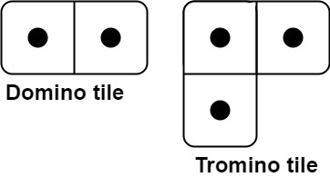
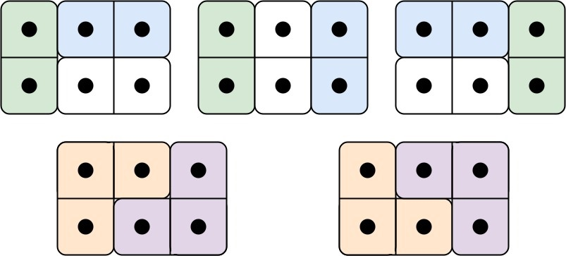

# Domino and Tromino Tiling

**Platform:** LeetCode
**Difficulty:** Medium
**Language:** Java
**Status:** ACCEPTED
**Problem:** [Domino and Tromino Tiling](https://leetcode.com/problems/domino-and-tromino-tiling/)
**Topics:** Dynamic Programming
**Patterns (inferred):** Dynamic Programming
**Runtime:** Accepted Runtime: 0 ms

---

## Problem Statement

You have two types of tiles: a `2 x 1` domino shape and a tromino shape. You may rotate these shapes.



Given an integer n, return *the number of ways to tile an* `2 x n` *board*. Since the answer may be very large, return it **modulo** `10^9 + 7`.

In a tiling, every square must be covered by a tile. Two tilings are different if and only if there are two 4-directionally adjacent cells on the board such that exactly one of the tilings has both squares occupied by a tile.

 

**Example 1:**



```
**Input:** n = 3
**Output:** 5
**Explanation:** The five different ways are shown above.
```

**Example 2:**

```
**Input:** n = 1
**Output:** 1
```

 

**Constraints:**

	- `1 <= n <= 1000`

---

**Solution:** [`solution.java`](./solution.java)
